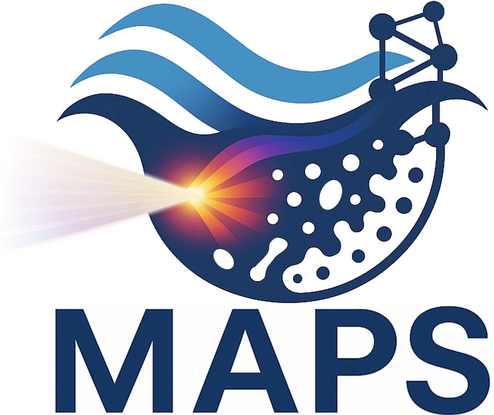
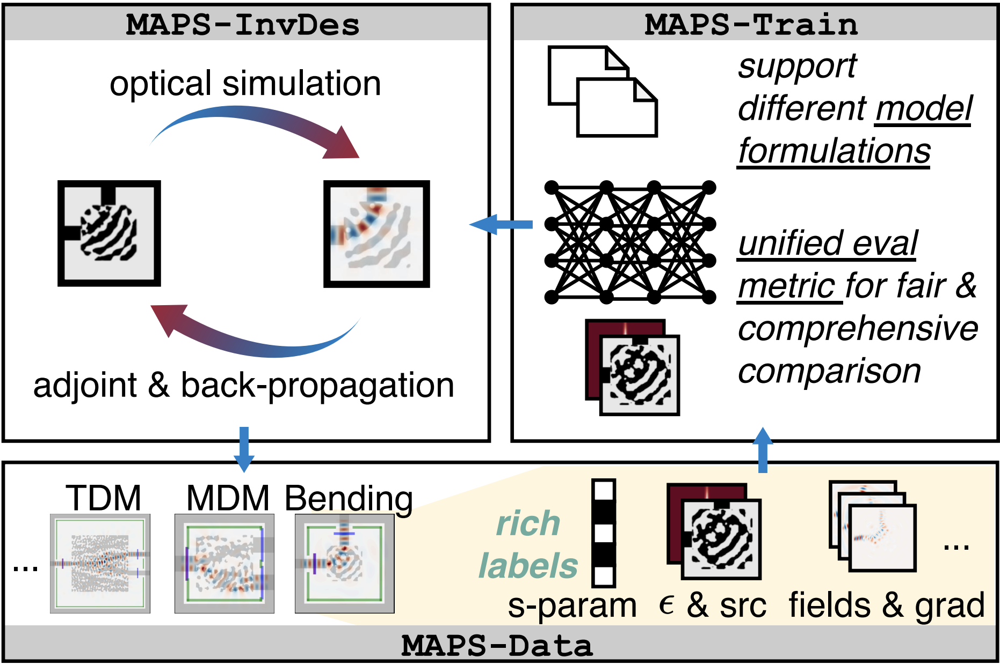
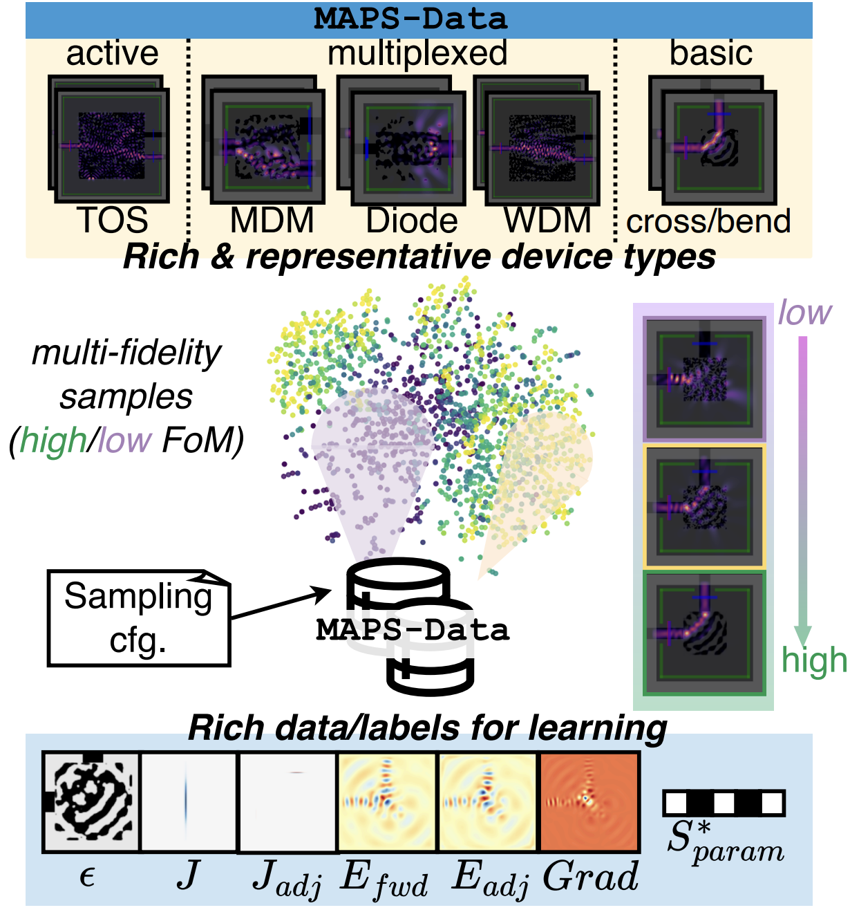
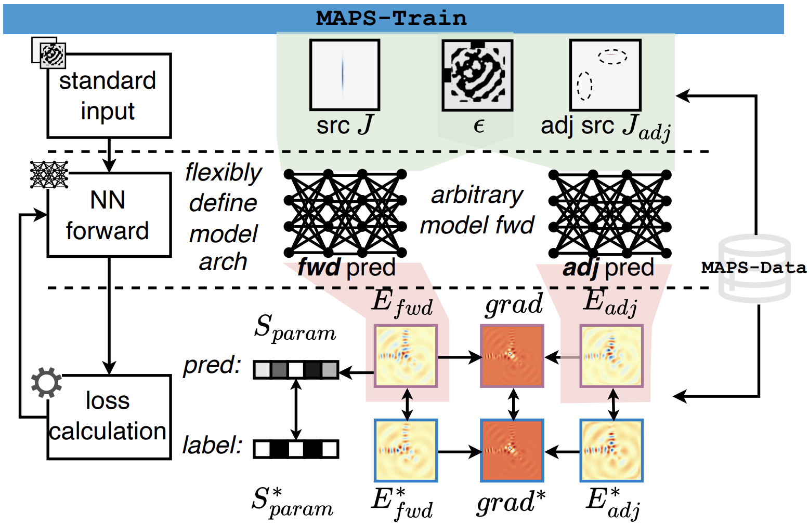
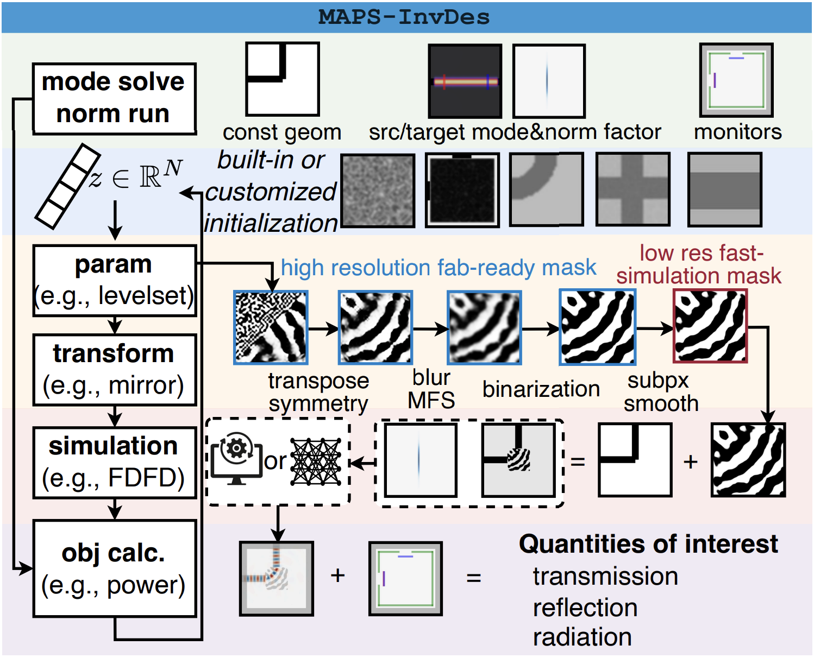

# MAPS: Multi-Fidelity AI-Augmented Photonic Simulation and Inverse Design Infrastructure

By Pingchuan Ma, Zhengqi Gao, Meng Zhang, Haoyu Yang, Mark Ren, Rena Huang, Duane S. Boning, and [Jiaqi Gu<sup>†</sup>](https://scopex-asu.github.io/index.html).

This repo is the official implementation of ["MAPS: Multi-Fidelity AI-Augmented Photonic Simulation and Inverse Design Infrastructure"](https://arxiv.org/abs/2503.01046) (DATE 2025)

<p align="center">
  
</p>

## News
[2025/11/05] Released v0.0.3
- Integrate [pydiso](https://github.com/simpeg/pydiso) solver to enable reusing matrix symbolic factorization for speedup. For the same polarization (e.g., Ez), there is only one solver instance as all matrices have the same sparse structure to avoid memory explosion.
- Add EtchMMI device with rectangles in the design region.
- Add continuous geometry parameterization. Support rectangles (box) with gradient calculation.

[2025/10/19] Released v0.0.2
- MAPS-InvDes supported. Levelset-based photonic device inverse design
- MAPS-Data supported. Photonic simulation dataset generation, including forward fields, adjoint fields, S parameters, etc.
- MAPS-train supported. Framework for AI model training for optical simulation prediction.


## Table of Contents

- [Introduction](#introduction)
- [Features](#features)
- [Folder Structure](#folder-structure)
- [Prerequisites](#Prerequisites)
- [Installation](#installation)
- [Usage](#usage)


## Introduction

Inverse design has emerged as a transformative approach for photonic device optimization, enabling the exploration of high-dimensional, non-intuitive design spaces to create ultra-compact devices and advance photonic integrated circuits (PICs) in computing and interconnects. However, practical challenges, such as suboptimal device performance, limited manufacturability, high sensitivity to variations, computational inefficiency, and lack of interpretability, have hindered its adoption in commercial hardware. Recent advancements in AI-assisted photonic simulation and design offer transformative potential, accelerating simulations and design generation by orders of magnitude over traditional numerical methods. Despite these breakthroughs, the lack of an open-source, standardized infrastructure and evaluation benchmark limits accessibility and cross-disciplinary collaboration. To address this, we introduce **MAPS**, a multi-fidelity AI-augmented photonic simulation and inverse design infrastructure designed to bridge this gap. MAPS features three synergistic components: (1) **MAPS-Data**: A dataset acquisition framework for generating multi-fidelity, richly labeled devices, providing high-quality data for AI-for-optics research. (2) **MAPS-Train**: A flexible AI-for-photonics training framework offering a hierarchical data loading pipeline, customizable model construction, support for data- and physics-driven losses, and comprehensive evaluations. (3) **MAPS-InvDes**: An advanced adjoint inverse design toolkit that abstracts complex physics but exposes flexible optimization steps, integrates pre-trained AI models, and incorporates fabrication variation models. This infrastructure MAPS provides a unified, open-source platform for developing, benchmarking, and advancing AI-assisted photonic design workflows, accelerating innovation in photonic hardware optimization and scientific machine learning.

<p align="center">
  

</p>

In **MAPS-Data**, users can sample photonic device data using customized sampling strategy.
<p align="center">
  
</p>

**MAPS-Train** supports AI model training using MAPS-Data as datasets for AI-assisted photonic device simulation and inverse design. It supports standardized input,
flexible neural network model definition, and diverse datadriven/physics-driven loss function calculation.
<p align="center">
  
</p>

**MAPS-InvDes** is a framework with full support of simulation and adjoint-based inverse design. Users can use the AI models trained from MAPS-Train to accelerate inverse design.
<p align="center">
  
</p>

## Folder Structure
- **configs/**: Configuration files for various simulation aspects.
  - **fdfd/**: Hierarchical YAML configuration files.
- **core/**: Contains the core codebase of MAPS.
  - **fdfd/**: Differentiable FDFD solver.
  - **invdes/**: MAPS-InvDes framework: optimization plan, device definition, and examples.
  - **train/**: MAPS-Train framework: datasets, examples, model definition, builder, etc.
  - **data/**: MAPS-Data framework: generate device simulation datasets.
- **scripts/**: Experiment launching scripts.
- **thirdparty/**: Thirdparty libraries.
  - **ceviche/**: Thirdparty ceviche for FDFD inverse design.
- **unitest/**: Example scripts demonstrating module usage.

## Prerequisites

- Python 3.11 or higher
- Required Python packages (listed in requirements.txt)
- pyutils[https://github.com/JeremieMelo/pyutility]

## Installation
```git clone https://github.com/ScopeX-ASU/MAPS```

## Usage
1. run examples of inverse design, e.g., waveguide bending
```
python core/invdes/examples/bending.py
```
or
```
python scripts/device/train.py
```
2. generate photonic device simulation datasets, e.g., generate 8 bending devices with perturbation applied
```
python data/fdfd/dataset_generation_launcher.py \
  --device-name bending \
  --num-devices 8 \
  --num-gpus 4 \
  --include-perturb
```

3. train AI model on device dataset for forward Maxwell Equation prediction task, e.g., Fourier neural operator on bending forward Ez field prediction.
```
python scripts/nn/fno/train_fwd_model.py
```


# Citing MAPS
```
@inproceedings{ma2025maps,
      title={{MAPS: Multi-Fidelity AI-Augmented Photonic Simulation and Inverse Design Infrastructure}},
      author={Pingchuan Ma and Zhengqi Gao and Meng Zhang and Haoyu Yang and Mark Ren and Rena Huang and Duane S. Boning and Jiaqi Gu},
      year={2025},
      booktitle={Design, Automation and Test in Europe Conference (DATE)},
      url={https://arxiv.org/abs/2503.01046},
}
```
```
Pingchuan Ma, Zhengqi Gao, Meng Zhang, Haoyu Yang, Mark Ren, Rena Huang, Duane S. Boning and Jiaqi Gu, "MAPS: Multi-Fidelity AI-Augmented Photonic Simulation and Inverse Design Infrastructure," Design, Automation and Test in Europe Conference (DATE), Lyon, France, Mar. 31 - Apr. 02, 2025.
```
